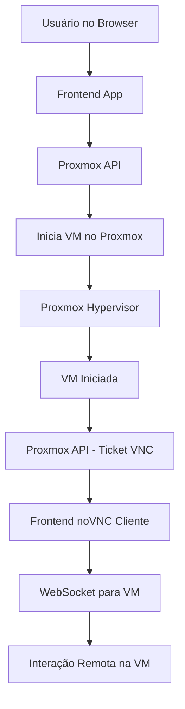
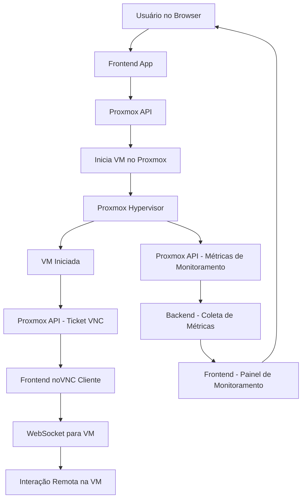

# Cecyber

Segue abaixo uma nova versão da solução, formatada como uma proposta para o cliente, incluindo um diagrama em formato **Mermaid**.

---

**Proposta de Solução para Iniciar e Acessar Máquinas Virtuais no Proxmox via Frontend**

---

### **Fluxo da Solução**

1. **Iniciar a Máquina Virtual via API:**
   - Sua aplicação frontend enviará uma solicitação para a API do Proxmox VE solicitando o início da VM específica.
   - Para segurança, será utilizado um token de API gerado previamente e armazenado em um ambiente seguro.

2. **Obter Ticket VNC e Porta de Comunicação:**
   - Após iniciar a VM, a aplicação requisitará à API um ticket temporário e a porta correspondente para o acesso remoto via VNC.

3. **Estabelecer Conexão com noVNC:**
   - Com o ticket gerado, o frontend carregará o cliente noVNC embutido no navegador e configurará a conexão com a VM por meio do WebSocket disponibilizado pelo Proxmox.

4. **Interação Remota pelo Navegador:**
   - O cliente final poderá acessar a interface gráfica da VM diretamente no navegador, interagindo em tempo real com o sistema operacional ou a aplicação hospedada.

---

### **Diagrama de Funcionamento**

---

### **Componentes da Solução**

1. **Frontend:**
   - Será responsável por interagir com a API do Proxmox e gerenciar o cliente noVNC.
   - Garantirá que apenas usuários autenticados possam iniciar e acessar as máquinas virtuais.

2. **API do Proxmox:**
   - Permitirá operações como iniciar/parar VMs, obter tickets VNC e monitorar o status das máquinas.
   - Sua arquitetura RESTful será utilizada para integração direta com o frontend.

3. **noVNC:**
   - Uma interface gráfica no navegador permitirá que os usuários interajam com as máquinas virtuais remotamente, utilizando a conexão VNC encapsulada em WebSockets.

4. **Proxmox VE:**
   - O hipervisor que gerencia as máquinas virtuais e fornece os recursos necessários para o ambiente operacional.

5. **VM:**
   - As máquinas virtuais serão configuradas para rodar sistemas operacionais ou aplicações específicas, de acordo com as demandas do cliente.

---

### **Vantagens da Solução**

- **Segurança:** Toda a comunicação será protegida por HTTPS, e os tickets VNC terão validade limitada para garantir acesso seguro.
- **Automação:** A integração com a API do Proxmox permite que os processos sejam escaláveis e facilmente replicáveis.
- **Flexibilidade:** Usuários poderão acessar as máquinas virtuais de qualquer dispositivo com navegador, eliminando a necessidade de clientes específicos.
- **Centralização:** O gerenciamento das VMs será feito de forma centralizada e automatizada, reduzindo a complexidade operacional.

---
### **Monitoramento das Máquinas Virtuais**

**Backend:**
- O backend realizará requisições periódicas à API do Proxmox para obter métricas de desempenho das máquinas virtuais, como:
  - Uso de CPU
  - Consumo de memória
  - Taxa de I/O de disco
  - Tráfego de rede
  - Status das VMs (ligada/desligada)
- Essas informações serão armazenadas temporariamente para exibição em tempo real no frontend.

**Frontend:**
- O frontend exibirá essas métricas em painéis interativos, permitindo ao usuário monitorar o desempenho das VMs em tempo real.
- Alertas visuais podem ser configurados para informar o usuário sobre situações críticas, como uso excessivo de recursos.

**Ações Disponíveis:**
- Os usuários poderão iniciar/parar máquinas diretamente do painel de monitoramento.
- Gráficos históricos serão exibidos para analisar tendências de desempenho.

---

### **Diagrama de Funcionamento**

